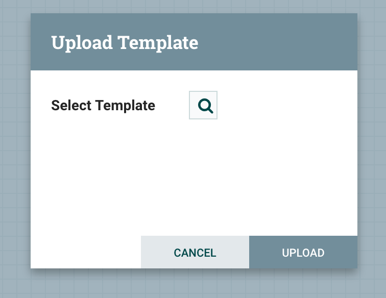
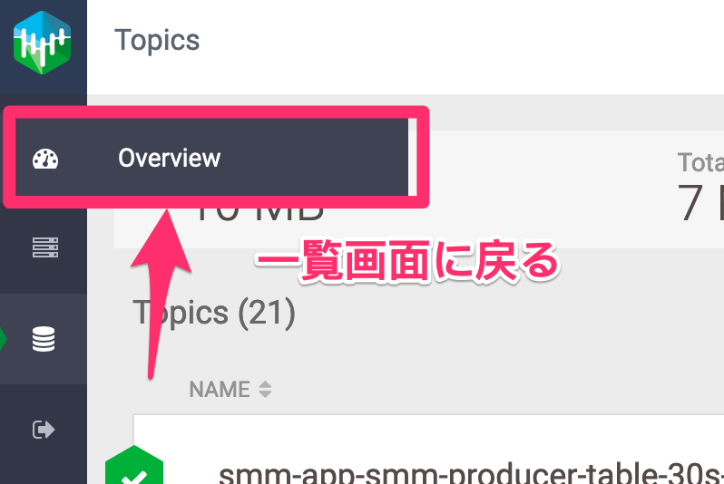
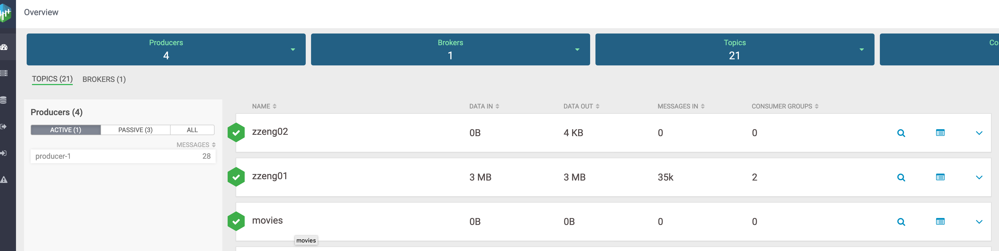

# Cloudera CDP / CDF Workshop


## Hands on概要：
1) NiFi でテストデータを集めて、Kafkaに送る

2) SMMのWebUIで、KafkaのTopic作成とKafka管理

3) NiFiで、KafkaのデータをHDFSに保存

4) HDFSに保存したデータをHUE+Hiveで分析

5) HDFSに保存したデータをCML+Sparkで分析


## 1)データ収集
自分のアカウント・サーバーを取得。
サーバーアドレス：


### 1.1 Cloudera Managerにログイン
CM URL:

NOTE: 参加者が利用するEC2インスタンスのIPアドレスが異なる

http://<public-ip>:7180/cmf/login

admin/admin

### 1.2 NiFi でデータ収集のデータフロー作成

image::smm/105_CM.png[width=800]

#### 1.2.1 NiFi にログイン


#### 1.2.2 テンプレートをアップロード

link::smm/produce-movies.xml[NiFi->Kafkaへのテストデータ生成データフロー]

image::smm/110_NiFi_Template.png[width=800]




NOTE: プロセッサーグループ（プロセッサーのフォルダみたいなもの）を作成し、プロセッサーグループに入る


#### 1.2.3 Template を選択：

image::smm/114_NiFi_Choose_Temp.png[width=800]

#### 1.2.4 Template Import完了


### 1.3 SMM でKafka管理

#### 1.3.1 SMM にログイン


#### 1.3.2 SMMで、KafkaのTopic作成


#### 1.3.3 SMMで、KafkaのTopic確認




#### 1.3.4 NiFiで、KafkaのTopicにメッセージを投入





#### 1.3.5 SMMで、KafkaのTopicとProducer関係の確認


#### 1.3.6 NiFiで、Kafkaに入ったデータを読み込んで、ある程度纏めてHDFSに保存

link::smm/consume-movies.xml[NiFiでKafkaからHDFSへデータ保存データフロー]

image::smm/110_NiFi_Template.png[width=800]


## 2) Hive、HUE、CDSW(CML)でデータを分析・ETL


image::smm/204_HUE_6.png[width=800]


image::smm/210_CML_02.png[width=800]


```sql
create database testdb;
use testdb;
create table test01 (a01 string);

CREATE EXTERNAL TABLE IF NOT EXISTS movies
  (ID int,
  title string,
  genres string
  )
  ROW FORMAT DELIMITED
  FIELDS TERMINATED BY ','
  STORED AS TEXTFILE
  LOCATION '/tmp/movies';

select count(*) from testdb.movies;

select * from testdb.movies limit 10;
```


```scala
//import org.apache.spark
import org.apache.spark.sql.types._;

val schema = (new StructType).add("id", IntegerType).add("title", StringType).add("genres", StringType)

val input_df = spark.read.option("Sep", ",").schema(schema).csv("/tmp/movies/")
input_df.write.option("compression", "snappy").parquet("/tmp/movies_parquet/")
```